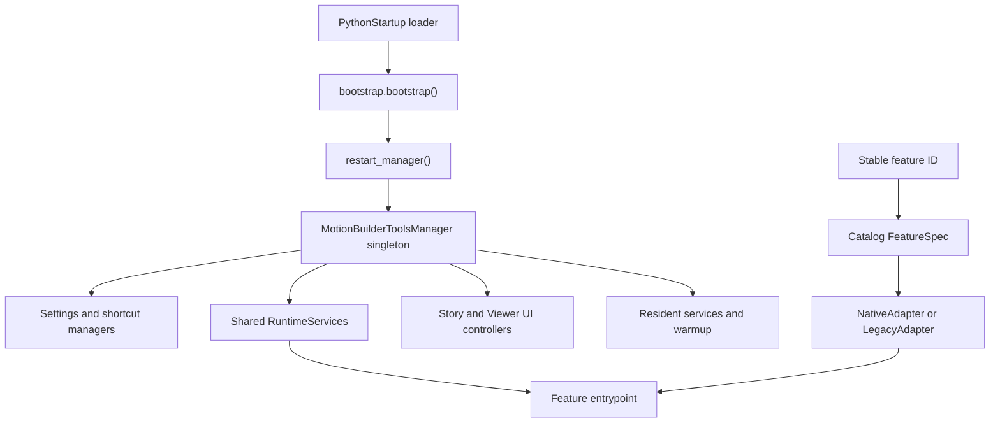

# MotionBuilder Tools Manager

`mobu_tools_manager` is the lifecycle, dispatch, shortcut, UI, and shared-runtime
layer for the managed Python tools in this MotionBuilder configuration. It
starts once with MotionBuilder, exposes features through stable IDs, and owns
the callbacks, Qt resources, input state, settings, and cleanup needed to make
reloads safe.

This README covers this package and its direct integration points only. For the
detailed lifecycle rules and migration contracts, see the
[engineering guide](../MOBU_TOOLS_MANAGER_GUIDE.md).

## Current scope

The catalog currently contains 66 managed features:

- 33 use manager-native modules under `mobu_tools_manager`.
- The remaining entries use the compile-once legacy adapter for scripts that
  have not yet been migrated.
- Features are grouped under Transform, FCurves, Objects/Scene,
  Animation/Story, Input/UI, Pickers, and Developer.

The package targets MotionBuilder 2024-2027 and Python 3.10-3.13. It uses
`pyfbsdk`, `pyfbsdk_additions`, and the Qt binding bundled with MotionBuilder:
PySide6 when available, with a PySide2 fallback. Input capture and some native
UI operations are Windows-specific. Fast Render additionally requires an
`ffmpeg` executable with the `qtrle` encoder available on `PATH`.

## Startup and everyday use

MotionBuilder starts the manager through:

[`../../PythonStartup/000_MobuToolsManagerBootstrap.py`](../../PythonStartup/000_MobuToolsManagerBootstrap.py)

The startup loader adds the sibling `Scripts` directory to `sys.path` and calls
`mobu_tools_manager.bootstrap.bootstrap()`. Bootstrap shuts down any previous
manager before constructing a replacement, so running the loader again must
not duplicate callbacks, filters, timers, menus, tools, or helper resources.

The editable source copy of the startup loader is
[`bootstrap_template.py`](bootstrap_template.py). Keep it identical to the file
in `PythonStartup` when startup behavior changes.

Open the modeless manager window from:

```text
Python Tools > MotionBuilder Tools Manager
```

That entry is a short-lived Qt menu action which opens the modeless manager
window directly. On startup, the manager removes an old native `FBTool` entry
with the same name so it cannot produce a second, empty undocked window.

The window supports search, feature actions, shortcut editing, Quick Favorites
configuration, interaction settings, status/timing inspection, and explicit
diagnostics export. Right-click a feature row for **Run** or **Stop**,
**Enable** or **Disable**, **Reload**, and shortcut actions. Double-click an
ActionScript-backed feature row to edit its shortcut. The lower row contains
only **Quick Favorites...** and **Export Diagnostics**. The Python Tools menu
also receives dynamic **Start / Stop Codex Bridge** and **Start / Stop
Antigravity Bridge** actions while it is visible.

The Viewer toolbar includes **Fast Render** followed by an **Export** split
control. **Fast Render** captures the active take from the current Viewer camera
to a QuickTime Animation (`.mov`) movie, matching the active camera's grid
visibility (`ShowGrid`/`ViewShowGrid`). **Export** writes the configured
hierarchy objects to FBX; its narrow down-arrow opens scene-specific settings
for the destination folder/file, one-take-per-file behavior, and the exact
hierarchy objects to include. These custom toolbar controls do not accept
keyboard focus, so Enter remains available to the active MotionBuilder context
after a toolbar click.

For manual use from MotionBuilder's Python editor:

```python
from mobu_tools_manager import restart_manager, show_manager

restart_manager()
show_manager()
```

## Runtime flow



`builtins._motionbuilder_tools_manager` is the one intentional global owner.
Feature modules must not create competing lifecycle singletons in `builtins`.

## Package map

| Path | Responsibility |
| --- | --- |
| [`__init__.py`](__init__.py) | Small, stable public API and reload-safe singleton access. |
| [`bootstrap.py`](bootstrap.py) | Idempotent startup and Python Tools actions for the manager and bridges. |
| [`manager.py`](manager.py) | Feature dispatch, enable/disable/reload, shortcuts, warmup, diagnostics, and shutdown orchestration. |
| [`catalog.py`](catalog.py) | Declarative `FeatureSpec` catalog, stable IDs, categories, dependencies, entrypoints, slots, and validation. |
| [`runtime.py`](runtime.py) | Shared MotionBuilder/Qt services exposed through `CommandContext`. |
| [`native.py`](native.py) | Import-once adapter for manager-native modules. |
| [`legacy.py`](legacy.py) | Compile-once compatibility adapter for existing standalone scripts. |
| [`settings.py`](settings.py) | Versioned per-user settings, validation, invalid-file recovery, and atomic writes. |
| [`shortcuts.py`](shortcuts.py) | ActionScript and keyboard-profile parsing, conflicts, backups, rescans, and temporary native-action dispatch. |
| [`ui.py`](ui.py) | Modeless manager window. |
| [`diagnostics.py`](diagnostics.py) | Bounded in-memory event history and explicit JSON export. |
| [`generated_actions/`](generated_actions/) | Tiny ActionScript wrappers that call `dispatch(stable_feature_id)`. |

### Functional subpackages

| Package | Responsibility |
| --- | --- |
| [`features/`](features/) | Manager-native command, tool, and service entrypoints. |
| [`interactions/`](interactions/) | Shared G/R/S state machine, input policy, constraints, numeric input, cursor, and overlay presentation. |
| [`object_transforms/`](object_transforms/) | Viewer move/rotate/scale strategies, target snapshots, frozen axis guide, and HIK manipulation. |
| [`fcurves/`](fcurves/) | Focused visible-channel discovery, direct key insertion, key snapshots/mutation, view mapping, move/scale, and tangent operations. |
| [`story/`](story/) | Story clip operations, settings, native toolbar integration, and native context-menu integration. |
| [`viewer/`](viewer/) | Manager-owned controls positioned beside the native Viewer toolbar. |
| [`quick_favorites/`](quick_favorites/) | Quick Favorites settings validation and editor UI. |
| [`exporting/`](exporting/) | Scene-persistent FBX export settings, hierarchy editor, and exact-model export. |

## Shared runtime services

`RuntimeServices` constructs one shared service graph and passes a lazy
`CommandContext` to native feature entrypoints. The context exposes:

- MotionBuilder system, application, player, action manager, scene, current
  take, and current animation layer.
- Selection and scene indexes with explicit invalidation.
- Focused visible-FCurve discovery and graph-view transforms. Hidden channels
  with selected keys are never action targets.
- One Qt application event filter and UI-context classifier.
- One input router, interaction coordinator, cursor/overlay coordinator, and
  coalesced evaluation scheduler.
- Undo helpers and manager-owned HIK character manipulation.
- Shared Story settings and diagnostics.

Scene destruction, file open/new, take replacement, UI reconstruction, and
wrapper-access errors invalidate the relevant caches. Native features must
reacquire MotionBuilder and native Qt wrappers through the context instead of
retaining them indefinitely.

The shared FCurve graph transform validates competing axis-label OCR scales
against MotionBuilder's 1/2/5 major-grid cadence. This prevents an internally
consistent digit misread from making multi-key G/R/S gestures move at an
integer-multiple value speed. Axis-label hypotheses are matched by logical
major-grid steps before their values are fitted to physical pixel rows, so
integer-rounded 42/43-pixel gaps cannot shift the Scale pivot. Equally
supported hypotheses prefer the closest 1/2/5 cadence before a small OCR mask
score advantage. Strong selected-key horizontal guide rows are used even when
the graph exposes no matching vertical guide, and their multi-key alignment is
the strongest calibration signal. When multiple selected keys expose only the
top and bottom selection bounds, those rows and the captured value extrema
directly determine both vertical scale and origin before OCR is considered.

### Interactive transform transitions

Viewer Move, Rotate, and Scale capture one immutable operation-start snapshot.
Every valid X/Y/Z press starts a new segment at the axis-key cursor while
retaining typed numeric input. Move retains only the pre-lock displacement on
the newly active axis, Rotate retains only the angular twist around that axis,
and Scale retains only that axis's current scale factor; all other components
are restored. Cycling any transform to off restores all components.
Scale completes its axis-transition evaluation before capturing the next
segment, preventing stale free-scale values from returning on the other axes.

Changing to a different G/R/S mode fully cancels the current operation before
the replacement captures. Repeating G in Viewer Move and S in Viewer Scale is
a consumed no-op. Repeating R in Viewer Rotate is the exception: it restores
the original rotations, clears the axis, and switches orbit/trackball mode in
the same undo/input session. FCurve Move axis changes retain only the locked
time or value component and restore the other; unlocking restores both.
FCurve tangent/scale constraints and Shift/Ctrl modifier changes keep their
continuous-rebase behavior.

All `pyfbsdk` calls must run on MotionBuilder's main UI thread. Native hook or
worker callbacks may enqueue primitive data, but they must not access SDK
objects directly.

## Manager-native features

These catalog entries currently point directly at modules in `features/`:

| Stable ID | Kind | Implementation |
| --- | --- | --- |
| `transform.move_camera_plane` | command | `features/transform_move.py` |
| `transform.rotate_mouse_orbit` | command | `features/transform_rotate.py` |
| `transform.precision` | tool | `features/transform_precision.py` |
| `transform.scale_mouse_distance` | command | `features/transform_scale.py` |
| `viewer.toggle_global_local_reference` | resident service | `features/reference_mode.py` |
| `viewer.display_mode_menu` | resident service | `features/viewer_display_menu.py` |
| `animation.playback_frame_mode_menu` | resident service | `features/playback_frame_mode.py` |
| `fcurves.add_key` | command | `features/fcurve_add_key.py` |
| `objects.find_in_hierarchy` | command | `features/find_in_hierarchy.py` |
| `ui.quick_favorites` | tool | `features/quick_favorites.py` |
| `story.reset_selected_clips` | command | `features/story_reset_clips.py` |
| `story.move_selected_clips_to_zero` | command | `features/story_move_clips_to_zero.py` |
| `story.insert_current_take` | command | `features/story_insert_current_take.py` |
| `animation.render_side_front` | command | `features/render_two_cameras.py` |
| `scene.export_fbx` | command | `features/export_fbx.py` |
| `animation.timeline_go_to_next_take` | command | `features/timeline_navigation.py` |
| `animation.timeline_go_to_previous_take` | command | `features/timeline_navigation.py` |
| `animation.timeline_step_forward_10_frames` | command | `features/timeline_navigation.py` |
| `animation.timeline_step_backward_10_frames` | command | `features/timeline_navigation.py` |
| `animation.timeline_go_to_take_start` | command | `features/timeline_navigation.py` |
| `animation.timeline_go_to_take_end` | command | `features/timeline_navigation.py` |
| `animation.timeline_step_forward_fps` | command | `features/timeline_navigation.py` |
| `animation.timeline_step_backward_fps` | command | `features/timeline_navigation.py` |
| `animation.timeline_next_marker` | command | `features/timeline_navigation.py` |
| `animation.timeline_previous_marker` | command | `features/timeline_navigation.py` |
| `animation.timeline_add_local_marker` | command | `features/timeline_navigation.py` |
| `input.timeline_navigation_hotkeys` | resident service | `features/timeline_navigation.py` |
| `ui.save_options_templates` | resident service | `features/save_options_templates.py` |
| `input.alt_wheel_preview_speed` | resident service | `features/alt_wheel_preview_speed.py` |
| `input.character_keying_hotkeys` | resident service | `features/character_keying_hotkeys.py` |
| `animation.timeline_marker_labels` | resident service | `features/timeline_marker_labels.py` |
| `selection.deselect_all` | resident service | `features/deselect_all.py` |
| `developer.codex_bridge` | on-demand service | `features/codex_bridge.py` |
| `developer.antigravity_bridge` | on-demand service | `features/antigravity_bridge.py` |

Every other catalog entry is still represented through `LegacyAdapter`. That
adapter reads and compiles a legacy source file once, retains its namespace when
required, and exposes the declared entrypoint without repeatedly reading the
file. Do not bypass either adapter from new integrations.

## Stable public API

External wrappers should import only from `mobu_tools_manager` and address
features by stable catalog ID:

```python
from mobu_tools_manager import (
    disable,
    dispatch,
    dispatch_native_action,
    enable,
    get_manager,
    reload_feature,
    restart_manager,
    show_manager,
)

dispatch("story.insert_current_take")
```

Do not import a feature implementation directly in new launchers. Existing
compatibility files may do so to preserve an older callable interface, but they
are not the pattern for new code.

## Feature contracts

Manager-native modules have no autorun behavior. Their catalog kind determines
the lifecycle contract.

Command:

```python
def execute(context):
    ...
```

Tool:

```python
def show(context):
    ...

def close():
    ...
```

Service:

```python
def start(context):
    ...

def stop():
    ...

def status():
    return {"running": True}
```

`start()` must be idempotent. `stop()` must completely reverse partial and
complete startup, including callbacks, observers, timers, hooks, helpers,
widgets, cursor state, and retained wrappers. Cleanup must also be safe from the
manager's early `FBApplication.OnFileExit` callback.

## Adding or migrating a feature

1. Choose a permanent, descriptive feature ID. Paths and display names may
   change; the ID must remain stable.
2. Implement the appropriate native contract in `features/` or a focused
   subpackage. Do not execute feature logic at import time.
3. Add a `FeatureSpec` to [`catalog.py`](catalog.py).
4. Use `files` only for represented legacy, launcher, or startup paths. Record
   manager-native modules and shared helpers in `implementation_files`.
5. Declare dependencies, action slot, default shortcut, warmup policy, context
   requirements, resident state, and stop entrypoint explicitly.
6. Dispatch through the package API. Do not add a second global event filter,
   application-exit callback, input router, cursor owner, or evaluation loop.
7. Add offline tests and run catalog validation. Keep a legacy feature active
   until its native replacement passes the required live MotionBuilder checks.

For G/R/S and FCurve migrations, follow the
[transform and FCurve migration standard](../MOBU_TRANSFORM_FCURVE_MIGRATION_STANDARD.md).

## Shortcuts and ActionScript

[`../ActionScript.txt`](../ActionScript.txt) maps manager-owned slots to the
two-line wrappers under [`generated_actions/`](generated_actions/). A wrapper
contains only:

```python
from mobu_tools_manager import dispatch
dispatch("stable.feature_id")
```

The manager preserves unmanaged ActionScript slots. Shortcut edits apply to the
currently active MotionBuilder interaction profile, block conflicts by default,
back up edited files, and request the appropriate MotionBuilder rescan. Because
the manager starts before MotionBuilder finishes applying the user's keyboard
mode, it refreshes the active profile before it displays or changes a shortcut.
Double-click an ActionScript-backed feature in the manager list, or right-click
it and choose **Edit Shortcut**, to open the shortcut editor. The same context
menu also offers **Run** (or **Stop** while the feature is running), the current
**Enable** or **Disable** action, **Reload**, and **Reset Shortcut**.
Conflict warnings show a managed feature or legacy ActionScript filename when it
can be resolved, alongside the canonical MotionBuilder action name. Multiple
bindings use native `|` syntax, for example:

```text
{CTRL:J*DN}|{CTRL:J*UP}
```

No-modifier G, R, and S have an additional resident launch path through the
shared Qt filter for immediate Viewer response. Their ActionScript wrappers
remain the fallback path.

`X` toggles the Viewer reference mode between Global and Local while the pointer
is over the Viewer. The resident service uses the shared input router and sends
MotionBuilder's existing `F5`/`F6` Viewer shortcut pair directly, so it does
not rewrite or rescan the active keyboard map while the application runs.
When MotionBuilder does not expose the current native Viewer action to Qt, the
first press assumes Global and switches to Local; later presses use the
manager's tracked mode.

The backtick key (`` ` ``) opens **Playback Frame Mode**, a transient menu that
sets the transport's native `FBPlayerControl.SnapMode` to **No Snap**, **Snap
on Frames**, **Play on Frames**, or **Snap & Play on Frames**. It is routed by
the manager's shared input service, so it does not modify or rescan the active
keyboard profile.

`Z` opens **Viewer Display** only while the pointer is over a 3D Viewer.  Its
menu dispatches MotionBuilder's declared native actions for **Toggle
Overlays**, **Solid**, **Wire**, and **Toggle X-Ray** after the popup closes.
It uses the manager-owned temporary shortcut/restore boundary shared with
Quick Favorites; it does not call `FBRenderer.SetViewingOptions()` or match
same-named Qt actions from unrelated tools. It is routed through the shared
input service and remains inactive in text fields, dialogs, popups, and
non-Viewer contexts. Like Quick Favorites, the last selected row is centered
under the cursor when the menu next opens; the menu remains within the active
screen. The feature currently defaults to disabled after MotionBuilder 2026
crash investigation; enable it only after the native-action route is verified
in an isolated host session.

### Timeline navigation bindings

Timeline Navigation Hotkeys is a resident service on the manager's shared input
router. It handles the bindings below even when MotionBuilder does not dispatch
its ActionScript slots. Frame movement clamps to the take's inclusive start/end
frames; marker movement uses only the current take's time marks. A one-second
jump uses the rounded current transport FPS (for example, 30 frames at 30 fps).
`Alt+Down` and `Alt+Up` select the next and previous take respectively. The
catalogued commands retain ActionScript slots 7 and 8 without assigning default
shortcuts, while the resident service preserves these Blender-profile bindings
when MotionBuilder does not dispatch an ActionScript slot. They wrap from the
last take to the first, or from the first take to the last.

| Shortcut | Action |
| --- | --- |
| Shift+Up / Shift+Down | Forward / backward 10 frames |
| Shift+Left / Shift+Right | First / last frame of the current take |
| Ctrl+Up / Ctrl+Down | Forward / backward one transport second |
| Ctrl+Left / Ctrl+Right | Previous / next current-take marker |
| Ctrl+M | Add / remove local marker on current frame (toggle) |
| ActionScript slots 7 / 8 (no default binding) | Next / previous scene take, wrapping at either end |

### Full-body picker baking

The legacy-backed full-body picker is registered as `pickers.full_body`. Its
Window-menu, startup, and scene auto-open paths dispatch that stable feature ID
through the manager. **Bake to Skeleton** and **Bake Control Rig/Body Part**
read the active MotionBuilder transport time mode when clicked and plot at one
key per current transport frame. The bake row's `...` menu and the Character
Controls **Bake (Plot)** menu open separate Skeleton or Control Rig plot
settings before baking; those settings persist per destination. When a current
character is available, both `...` settings entries remain enabled so users can
configure either destination. Control Rig eligibility is checked only after
clicking **Bake** in its settings dialog. With **Body Part** or **Selection**
keying, a selected member of an extension attached to the active character also
enables the scoped Control Rig bake, matching Character Controls.

Right-clicking an IK or auxiliary effector opens its slider popup without first
refreshing the unrelated bake and toolbar controls. Periodic picker updates
share one Character Controls keying-mode snapshot, and normal selection uses
MotionBuilder's last-selected-model API without a redundant hard-selection
pass. Existing multi-effector selection and Viewer manipulator behavior are
preserved. Slider edits update their numeric readout immediately, coalesce scene
evaluation through one owned single-shot timer, and suspend the broad picker
refresh while the handle is down. Clicking outside therefore hides the popup
without running a full refresh for every intermediate slider value.

Auxiliary effectors visually indicate Reach Translation and Reach Rotation
through proportional half-circle fills (left for translation, right for rotation)
with color blending dynamically from green (0% pull) to red (100% pull) matching
IK effectors. Because MotionBuilder evaluates IK Pull on the limb's base effector
rather than auxiliary markers, the auxiliary effector's Pull slider delegates
directly to the connected base effector model. Adjusting Pull on either the base
effector or its auxiliary effector updates the value on the base effector and
synchronizes the green/red visual indicator across both markers simultaneously.
Property queries use exception-safe data access to protect against unsupported
property instances.

### Fast Render (video)

**Fast Render** (`animation.render_side_front`, implemented in `features/render_two_cameras.py`)
is a Viewer toolbar action for creating QuickTime Animation (`.mov`) preview videos:

- Captures frame snapshots across the current take's frame range using `FBVideoGrabber.RenderSnapshot`.
- Encodes the TIFF sequence to `.mov` with FFmpeg using the lossless `qtrle` codec.
- Resolves the active camera (named target, pane camera via `GetCameraInPane(0)`, or `FBCameraSwitcher().CurrentCamera`).
- Evaluates the active camera's grid setting (`ViewShowGrid` / `ShowGrid` / `PropertyList.Find('ShowGrid')`). When the grid is enabled in the active camera, grid lines are rendered in the output video.
- Temporarily enables camera anti-aliasing during capture, restoring all camera anti-aliasing states and the playhead time upon completion.

### Viewer FBX Export (FBX assets)

**Viewer FBX Export** (`scene.export_fbx`, implemented in `features/export_fbx.py` and `exporting/`)
is a Viewer toolbar split control for exporting scene hierarchy objects to FBX files:

- Located 25 px to the right of the Fast Render button with a touching narrow down-arrow button.
- Clicking the main **Export** button exports the configured objects to FBX using `FBMotionFileExportOptions` (`kFBSelectedModels`).
- Clicking the narrow down-arrow opens the scene-specific **Export Settings** dialog to configure the destination folder, FBX file name, one-take-per-file toggle, and exact checked hierarchy models.
- Settings are persisted as custom properties on a root-level `ExportPreset` model Null that is serialized and force-selected into the export set, ensuring configuration travels with the FBX file.
- Preserves and restores the user's pre-export model selection on both success and failure.
- Controls do not take keyboard focus, keeping Enter available for the active MotionBuilder context.

## Related scripts outside the package

These files are directly related to the manager but intentionally remain
outside this directory:

| Path | Relationship |
| --- | --- |
| [`../../PythonStartup/000_MobuToolsManagerBootstrap.py`](../../PythonStartup/000_MobuToolsManagerBootstrap.py) | Active MotionBuilder startup loader. |
| [`../ActionScript.txt`](../ActionScript.txt) | Native Python action-slot mapping. |
| [`../CustomFullBodyBonePicker.py`](../CustomFullBodyBonePicker.py) | Legacy-backed implementation for managed tool `pickers.full_body`. |
| [`../CustomFullBodyBonePickerWindowMenu.py`](../CustomFullBodyBonePickerWindowMenu.py) | Resident Window-menu and auto-open integration that dispatches `pickers.full_body`. |
| [`../custom/QuickFavoritesMenu.py`](../custom/QuickFavoritesMenu.py) | Compatibility launcher for `ui.quick_favorites`. |
| [`../custom/ResetSelectedStoryClips.py`](../custom/ResetSelectedStoryClips.py) | Compatibility launcher for `story.reset_selected_clips`. |
| [`../custom/InsertCurrentTakeToStory.py`](../custom/InsertCurrentTakeToStory.py) | Compatibility launcher for `story.insert_current_take`. |
| [`../Tasks/GoToNextTake.py`](../Tasks/GoToNextTake.py) | Compatibility launcher for `animation.timeline_go_to_next_take`. |
| [`../Tasks/GoToPreviousTake.py`](../Tasks/GoToPreviousTake.py) | Compatibility launcher for `animation.timeline_go_to_previous_take`. |
| [`../RenderSideFrontCameras.py`](../RenderSideFrontCameras.py) | Compatibility facade for Fast Render's older callable API. |
| [`../CodexMotionBuilderBridge.py`](../CodexMotionBuilderBridge.py) | Compatibility launcher for `developer.codex_bridge`. |
| [`../CodexMotionBuilderBridgeTool.py`](../CodexMotionBuilderBridgeTool.py) | Compatibility `start_bridge()` entrypoint. |
| [`../custom/icons/`](../custom/icons/) | Cursor artwork used by the shared transform presentation layer. |
| [`../tests/`](../tests/) | Offline unit tests and MotionBuilder integration checklist. |

Compatibility launchers should stay thin. Feature behavior, state, callbacks,
and UI ownership belong inside the manager package.

## User data and generated runtime data

The manager stores personal state outside the source package:

```text
<UserConfigPath>/MotionBuilderToolsManager/settings.json
<UserConfigPath>/MotionBuilderToolsManager/save_options_templates.json
<UserConfigPath>/MotionBuilderToolsManager/backups/runtime/
<UserConfigPath>/MotionBuilderToolsManager/backups/native-actions/
```

Settings are versioned, validated, and written atomically. Invalid JSON is
preserved as `settings.json.invalid-<timestamp>` before defaults are restored.
Enabled state and shortcuts are stored per stable feature ID and active
interaction profile.

FBX Export settings are scene data on one root-level `ExportPreset` model Null.
Its user custom properties store destination folder/file, take splitting, and
checked model long names. Export force-selects the Null so it is serialized by
the selected-model FBX export, while the settings hierarchy hides it. The
former `MOBU_TOOLS_MANAGER_EXPORT_SETTINGS` `FBUserObject` may be read only as
an in-memory migration source and is removed when settings are rewritten; live
testing confirmed that `FBUserObject` is not serialized into FBX and must never
be used as persistent storage. Older per-model markers are also migration-only.
Saving the source FBX keeps the model-Null settings in the working scene.

The native Codex Bridge uses a generated working area under:

```text
<UserConfigPath>/Scripts/.codex_mobu_bridge/
```

It contains command, running, done, result, status, heartbeat, and log files.
Treat it as runtime state, not source code.

Diagnostics remain in memory until the user explicitly exports a JSON file.
The manager UI proposes the `MotionBuilderToolsManager` settings directory as
the export location.

## Lifecycle rules

- The manager owns exactly one application-exit callback and one shared Qt
  application event filter.
- Multi-step scene mutations require a balanced MotionBuilder undo transaction.
- Structural or transform changes request evaluation through the shared,
  coalescing scheduler; do not evaluate inside tight loops.
- Native MotionBuilder toolbar rows are volatile geometry references, never
  parents for manager-owned controls.
- Manager-owned widgets attach to a stable pane, use bounded startup retries,
  and remove observers, timers, signals, and widgets during shutdown.
- SDK and native Qt wrappers must be reacquired after file, take, scene, or UI
  invalidation.
- Interactive features must release input, cursor, overlay, native capture,
  undo, HIK, callbacks, and focus ownership on commit, cancel, handoff,
  exception, disable, reload, and application exit.
- Do not use repeating idle polling when an SDK or shared UI event can perform
  the same invalidation.

## Verification

Run the offline suite from the `Scripts` directory with a compatible Python 3
environment:

```text
python -m unittest discover -s tests -v
```

Run only catalog checks with:

```text
python -m unittest discover -s tests -p "test_catalog.py" -v
```

Catalog edits must preserve unique IDs and ActionScript slots, valid dependency
references, declared entrypoints, physical-file coverage, and native
implementation-file coverage.

After offline tests, perform scene- and UI-dependent verification inside
MotionBuilder using the
[integration checklist](../tests/MOTIONBUILDER_INTEGRATION_CHECKLIST.md).
Interactive G/R/S changes require real Viewer camera-input regression after
both commit and cancel, not only mocked event-filter tests.

The warm dispatch performance targets are below 2 ms median and below 5 ms p95,
measured separately from feature execution. Warm dispatch must not reread or
recompile source, and the manager core must have no repeating idle timer.

## Further engineering documentation

- [MotionBuilder Tools Manager Guide](../MOBU_TOOLS_MANAGER_GUIDE.md) - detailed
  ownership, migration, cleanup, UI integration, and failure-pattern rules.
- [Transform and FCurve Migration Standard](../MOBU_TRANSFORM_FCURVE_MIGRATION_STANDARD.md) - normative interaction behavior and acceptance gates.
- [MotionBuilder Integration Checklist](../tests/MOTIONBUILDER_INTEGRATION_CHECKLIST.md) - live verification inside MotionBuilder.
