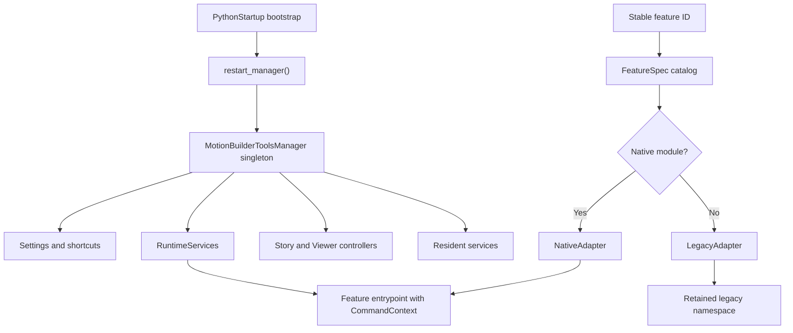

# Architecture

## Design goal

The manager turns a collection of standalone MotionBuilder scripts into one
reload-safe, observable runtime with stable feature IDs, shared services, and
deterministic cleanup. It supports native feature migrations without forcing
all legacy algorithms to change at once.

## System flow



## Startup sequence

1. MotionBuilder runs `PythonStartup/000_MobuToolsManagerBootstrap.py`.
2. The loader adds the sibling `Scripts` directory to `sys.path`.
3. `bootstrap()` calls `restart_manager()`.
4. Any previous singleton is shut down and removed from `builtins`.
5. The new manager initializes paths, loads settings, discovers the active
   keyboard profile, and imports first-run feature/binding state.
6. `RuntimeServices` creates and starts the shared service graph.
7. The manager configures native-action dispatch and G/R/S coordination.
8. Story and Viewer UI controllers start.
9. The manager registers exactly one early application-exit callback.
10. Enabled resident services start.
11. One-feature-per-idle warmup begins for eligible lazy features.
12. Python Tools integration is registered. Its transient Qt action opens the
    modeless manager window directly and retires the old same-named native
    `FBTool`, preventing an empty companion window.

Startup is idempotent at the public level: running the bootstrap again replaces
the previous manager rather than layering another runtime on top.

## Manager singleton

`builtins._motionbuilder_tools_manager` is the one intentional process-global
reference. It allows tiny ActionScript wrappers and compatibility launchers to
reach the existing manager without importing or rebuilding the heavy runtime.

The singleton owns:

- settings and shortcut managers;
- adapters and tracked feature resources;
- `RuntimeServices`;
- manager window;
- Story and Viewer UI controllers;
- Python Tools launcher;
- idle warmup and application-exit callbacks;
- in-memory diagnostics, feature timing/error state, and per-feature running
  state for the manager window's Run/Stop action.

Feature modules must not create parallel global owners.

The manager determines whether a feature is running from an active transform
interaction, a managed resource's `status()["running"]` value, or its tracked
persistent feature state. `stop_feature()` follows the feature's normal cleanup
path without changing its enabled preference, so the feature-row menu can later
start it again with **Run**.

## Feature catalog and adapters

`catalog.py` is the declarative registry. A `FeatureSpec` defines the stable ID,
display name, category, kind, represented files, primary implementation,
entrypoints, dependencies, ActionScript slot, defaults, warmup, context needs,
resident resources, and native implementation files.

### Native adapter

`NativeAdapter` imports one dotted module, calls its declared entrypoint, tracks
returned resources, records timing/errors, and unloads the feature plus declared
dependency modules during reload.

Native modules receive `CommandContext`. They contain no top-level autorun code.

### Legacy adapter

`LegacyAdapter` reads and compiles a standalone script once. Depending on its
catalog flags, it preserves first-load autorun behavior, invokes a retained
entrypoint, or re-executes cached bytecode. It allows incremental migration
without repeated source reads on every shortcut.

Legacy execution is compatibility behavior, not the target architecture for
new features.

## Runtime service graph

`RuntimeServices` constructs one shared graph:

| Service | Responsibility |
| --- | --- |
| `SelectionCache` | Generation-based selected-model snapshots. |
| `SceneIndex` | Incremental component membership/name lookup. |
| `FCurveService` | Focused visible/current-layer curve properties and explicit whole-scene fallback. Vector-child scope is resolved through the shared FCurve discovery helper. |
| `UIContextService` | One Qt filter, UI classification, surface geometry, focus restoration, shared observers. |
| `EvaluationScheduler` | Coalesced scene and FCurve refresh requests. |
| `InputRouter` | Shared event routing, resident shortcut launch (G/R/S, character keying, timeline navigation, Viewer reference mode/display menu, and playback frame mode), key/button state, capture cleanup. |
| `OverlayCoordinator` | One reusable overlay/cursor owner and terminal cleanup. |
| `UndoHelper` | Balanced MotionBuilder undo scopes. |
| `FCurveViewTransformCache` | Cached editor screen/time/value mapping with logical-row OCR, 1/2/5 cadence, independent horizontal-guide, and multi-key selection-bounds validation. |
| `HIKIndex` | Character/Control Rig topology and HIK manipulation sessions. |
| `InteractionManager` | One active interactive transform and atomic mode handoff. |

`CommandContext` lazily exposes these services and current MotionBuilder state to
native features.

`FCurveViewTransform` performs one visual calibration per graph generation when
MotionBuilder does not expose a direct value transform. Axis-label OCR can
produce several numerically consistent scales, so equally supported
hypotheses are first matched by logical major-grid steps and then fitted to
their physical image rows. This prevents alternating integer pixel gaps from
rejecting the correct labels. Hypotheses are checked against the graph's native
1/2/5 decimal grid cadence before raw OCR score is used.

Selected-key horizontal guides are a stronger signal than OCR. They are
detected independently of vertical guides so valid decimal-multiple scales can
be distinguished. For multi-key selections where MotionBuilder draws only top
and bottom horizontal bounds, the captured value extrema and those two rows
directly establish both vertical scale and origin; the result is accepted only
when its major-grid increment follows the 1/2/5 cadence. This prevents a
numerically correct scale from retaining an integer-offset value origin and
moving the FCurve Scale median pivot vertically.

## Invalidation model

The runtime prefers event-driven invalidation over polling.

- Selection changes invalidate selection snapshots.
- Component add/remove/rename updates or invalidates scene, FCurve, and HIK
  indexes.
- Destruction cancels active interactions before stale wrappers can be reused.
- Take changes invalidate take-dependent wrapper caches.
- File open/new rebinds the scene and invalidates all relevant services.
- UI rebuilds invalidate surface-specific graph transforms and require native
  control reacquisition.
- Wrapper access errors are treated as invalidation evidence, not ignored.

Stable cached data is limited to membership, topology, classification, and pure
data. Mutable transforms, key selection/value, time, key/button state, HIK mode,
pins, and Reach/Pull state are refreshed or frozen at the appropriate operation
boundary.

## Interaction architecture

G/R/S use one manager-level state machine:

```text
CREATED -> ARMING or ACTIVE -> COMMITTING/CANCELLING -> CLOSED
```

The resident Qt filter can launch no-modifier Viewer transforms directly on key
press. The ActionScript wrapper remains a fallback. A successful resident launch
consumes key-down, but the matching launcher key-up passes through to
MotionBuilder so native keyboard state is not stranded.

Other resident shortcuts register a launcher with this same router; they never
install a second application event filter. For example, Timeline Navigation
Hotkeys consumes Shift- or Control-arrow presses, plus the Blender-profile
`Alt+Up` (previous take) and `Alt+Down` (next take) bindings, when no transform
owns the router and focus is not a text editor, modal surface, or popup. These
two take-switch bindings are an input-router contract: their entries in
`features/timeline_navigation.py::HOTKEY_FEATURES` and the exact Alt handling
in `InputRouter._try_timeline_navigation_launcher()` must change together.
ActionScript slots 7 and 8 remain only the host fallback, so neither the route
nor its regression coverage may rely on MotionBuilder dispatching those slots.
Playback Frame Mode uses the same route for an unmodified backtick key, then
opens its transient menu after the key event returns. It assigns the requested native
`FBPlayerControl.SnapMode` value without changing or rescanning the active
keyboard profile. These routes keep shortcuts available when a host
ActionScript slot does not dispatch while preserving MotionBuilder's normal
editing and interaction input paths.

Viewer and FCurve strategies share:

- interaction policy and modifiers;
- axis constraint state;
- exact numeric input;
- captured immutable start state;
- cursor/overlay ownership;
- input capture and terminal guards;
- undo/evaluation coordination;
- commit, cancel, exception, and handoff cleanup.

HIK behavior is centralized in `object_transforms/hik.py`. Individual G/R/S
strategies must not reimplement character keying modes, body-part expansion,
pins, Reach, FK baselines, solve, or deformation cleanup.

## Native UI ownership

MotionBuilder native widgets are C++-owned and may be destroyed or rebuilt while
their Python wrappers still exist. Manager-owned controls therefore use this
shape:

```text
volatile native row -> primitive geometry snapshot
stable pane         -> manager-owned container -> owned button/actions
```

Controllers use the shared UI observer, exact accessible-name/control
signatures, guarded Shiboken validation, bounded startup retries, and complete
stop cleanup. They never parent owned controls directly to volatile native rows.
The Viewer controller owns one combined container for Fast Render and the FBX
Export split control. Both buttons dispatch stable feature IDs; the controller
does not execute render or export implementation modules directly.
Persistent marker labels and the bridge status badge are owned child widgets of
stable MotionBuilder panes, so native menus, context menus, popups, and undocked
windows remain above them. While `InputRouter.owner` is non-null, their shared
UI observers and queued refreshes do not change geometry, visibility, parenting,
or stacking. The interaction overlay remains a separate input-transparent
top-level window because it is part of the active G/R/S presentation contract.


## Codex Bridge architecture

The bridge is a manager-native, trusted local file queue. A 250 ms Qt timer runs
on MotionBuilder's main UI thread. It moves one `.py` command from `commands/`
to `running/`, executes it with bridge helpers, writes structured JSON under
`results/`, and archives the command under `done/`. A heartbeat is refreshed at
most every two seconds.

This design guarantees that bridge payloads execute on the MotionBuilder main
thread, but it also means long payloads block the UI. The bridge is not a socket
server, remote boundary, sandbox, or authenticated service. See
[Codex Bridge](CODEX_BRIDGE.md).

## Persistence

Personal data is stored under:

```text
<UserConfigPath>/MotionBuilderToolsManager/
```

`settings.json` includes versioned feature state, per-profile bindings,
interaction policy, Story settings, and Quick Favorites. Invalid JSON is copied
to a timestamped recovery file. Writes are atomic.

FBX Export settings are scene data rather than personal manager settings. One
root-level `ExportPreset` model Null carries user custom properties for the
destination folder/file, one-take-per-file behavior, and a JSON list of checked
model long names. The command reacquires the hierarchy for every export,
temporarily selects the exact configured models plus `ExportPreset`, calls
MotionBuilder's FBX motion export API, and restores the previous selection in a
`finally` path. The Null is excluded from the settings hierarchy. The former
named `FBUserObject` can only be an in-memory migration input and is removed
when settings are rewritten. Controlled live testing confirmed that
`FBUserObject` is not serialized into FBX at all in this workflow, including
after a manager reset, so it is prohibited as a persistence owner. Older
per-model properties are also migration-only.

Shortcut edits back up `ActionScript.txt` or the active keyboard profile before
replacement and rescan. Native-action dispatch temporarily borrows an unused
function-key binding and restores only its own change.

The bridge runtime queue lives under `Scripts/.codex_mobu_bridge/` and is not
source code.

## Shutdown sequence

The manager registers one `FBApplication.OnFileExit` callback so cleanup begins
before MotionBuilder destroys application and Qt objects.

Shutdown proceeds approximately as follows:

1. Remove the application-exit and idle-warmup callbacks.
2. Stop Viewer and Story controllers.
3. Close and queue-delete manager-owned windows.
4. Stop Python Tools integration and native-action dispatch.
5. Stop features in reverse catalog order and clean known resources.
6. Stop runtime services and cancel active interactions.
7. Process only queued Qt `DeferredDelete` events.
8. Clear the started/shutdown state.

No feature may depend on Python or Qt finalizers running after MotionBuilder has
started destroying its UI.

## Architectural invariants

- One manager singleton.
- One application-exit callback.
- One shared Qt application event filter.
- One active interactive transform.
- Stable feature IDs at every external boundary.
- Main-thread-only MotionBuilder and native Qt access.
- Explicit invalidation of C++ wrappers.
- Deterministic cleanup for every owned resource.
- No manager-core repeating idle timer.
- Idle warmup removes its callback through the exact registered `OnUIIdle` event
  wrapper.
- No routine whole-scene FCurve scan when displayed curves are available.

