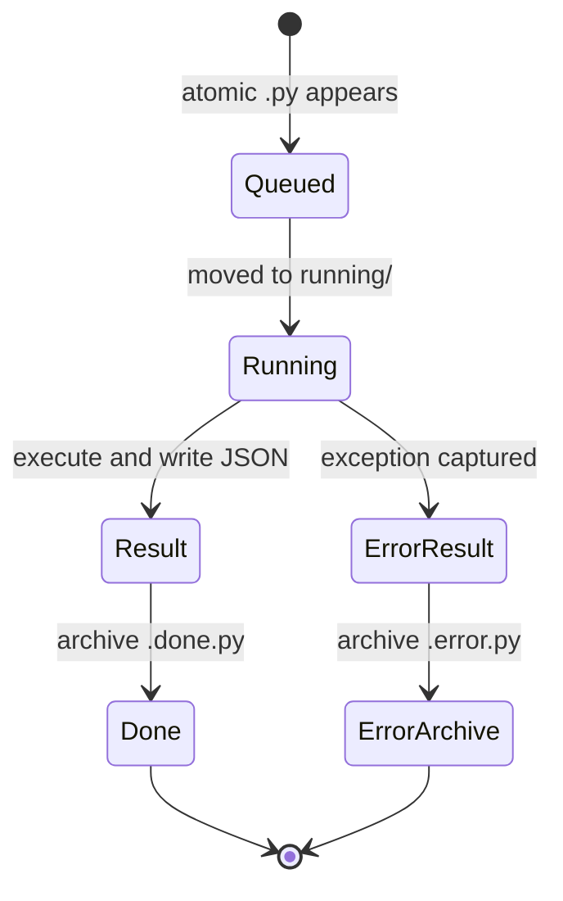

# Codex MotionBuilder Bridge

## Purpose

The Codex MotionBuilder Bridge lets a trusted external process place a Python
payload into a local queue and have MotionBuilder execute it on the main UI
thread. It returns a structured JSON result and preserves the processed command
for inspection.

The active implementation is:

[`Scripts/mobu_tools_manager/features/codex_bridge.py`](../Scripts/mobu_tools_manager/features/codex_bridge.py)

The loose `Scripts/CodexMotionBuilderBridge.py` and
`Scripts/CodexMotionBuilderBridgeTool.py` files are compatibility launchers that
dispatch the stable feature ID `developer.codex_bridge`.

## Important boundary

The current bridge is a **local file queue**, not a socket listener.

It provides:

- main-thread execution through a Qt timer;
- file claiming and archival;
- stdout/stderr capture;
- explicit result helpers;
- status, heartbeat, log, and diagnostics data;
- a small input-transparent Viewer badge while running.

It does not provide:

- sandboxing;
- authentication or authorization;
- a remote network boundary;
- parallel command execution;
- cancellation of a currently executing payload;
- protection from long-running code blocking MotionBuilder.

Treat every command file as trusted arbitrary code running inside the current
MotionBuilder process.

## Starting and stopping

From the MotionBuilder UI, open **Python Tools** and use the transient **Start
Codex Bridge** or **Stop Codex Bridge** action.

From MotionBuilder Python:

```python
from mobu_tools_manager import disable, dispatch

dispatch("developer.codex_bridge")
# Later:
disable("developer.codex_bridge")
```

The feature is enabled by default but is not resident and has `warmup="never"`.
It starts only when dispatched. Re-dispatching a running service returns its
status/resource rather than creating a duplicate.

## Runtime layout

The bridge root is calculated from the active package and resolves to:

```text
<UserConfigPath>/Scripts/.codex_mobu_bridge/
├── commands/
├── running/
├── done/
├── results/
├── logs/
│   └── bridge.log
├── status.json
└── heartbeat.txt
```

| Path | Meaning |
| --- | --- |
| `commands/` | Complete `.py` payloads waiting to run. |
| `running/` | A command claimed by the service before execution. |
| `done/` | Archived commands with `.done.py` or `.error.py` appended. |
| `results/` | Structured JSON results. |
| `logs/bridge.log` | Append-only bridge lifecycle/command summary. |
| `status.json` | Current service state and last-command metadata. |
| `heartbeat.txt` | Last liveness timestamp. |

This directory is generated runtime state, not project source.

## Liveness check

Before submitting a command:

1. Confirm `status.json` exists and parses.
2. Confirm `state` is `running` and `busy` is false, unless intentionally
   queueing behind one bounded command.
3. Confirm `heartbeat.txt` is recent. The service refreshes it at most every two
   seconds while its 250 ms poll timer runs.
4. Confirm MotionBuilder is responsive.
5. Check `last_error` before a batch operation.

Do not infer liveness only from the presence of the directory or an old status
file.

## Submitting a command

The service scans `commands/` in sorted filename order. It accepts non-hidden
files ending in `.py` and ignores names ending in `.tmp`.

Write payloads atomically:

1. Write a unique temporary filename ending in `.tmp` in the same directory.
2. Flush and close the file.
3. Rename/replace it to a unique `.py` filename.

This prevents MotionBuilder from claiming a partially written payload.

Use unique sortable names, for example:

```text
20260811_153045_scene_probe_a1b2.py
```

The bridge moves the file to `running/` before reading it. If an archive name
already exists, a millisecond suffix is added rather than overwriting it.

## Payload execution environment

Commands execute with:

| Name | Value |
| --- | --- |
| `__name__` | `__codex_mobu_command__` |
| `__file__` | Claimed path under `running/` |
| `BRIDGE` / `bridge` | `BridgeCommandContext` |
| `set_result(value)` | Marks an explicit result. |
| `bridge_log(*values)` | Records a bridge log line and prints it. |
| `RESULT` | Optional fallback result variable read after execution. |

Example read-only probe:

```python
from pyfbsdk import FBSystem

system = FBSystem()
take = system.CurrentTake
bridge_log("scene probe complete")
set_result(
    {
        "take": str(take.Name) if take is not None else None,
        "component_count": len(system.Scene.Components),
    }
)
```

If `set_result()` was called, its value wins. Otherwise the bridge uses the
global `RESULT` variable when present. Non-JSON-compatible values are replaced
by an object containing their `repr` and type name.

`bridge.bridge_root()` returns the queue root. `bridge.stop()` requests service
shutdown on the next timer tick after the current payload finishes.

## Main-thread behavior

The poll timer is a manager-owned Qt `QTimer` parented to the current
application. `_tick()` and payload execution therefore occur on MotionBuilder's
main UI thread.

This is why SDK calls are allowed inside a payload. It is also why payloads must
be bounded: a long loop, blocking process wait, network call, or heavy batch
freezes MotionBuilder's UI and prevents heartbeat updates.

Do not spawn a worker that retains MotionBuilder objects. If pure computation
must happen elsewhere, move only primitive data across the boundary and marshal
all SDK work back to the main thread.

## Command lifecycle



Only one command runs at a time. `busy` prevents reentrant timer work.

## Result schema

Each result JSON contains:

| Field | Meaning |
| --- | --- |
| `ok` | `true` when payload execution completed without exception. |
| `command` | Original command basename. |
| `command_path` | Claimed path used for execution. |
| `started_at`, `ended_at` | Local timestamps. |
| `duration_ms` | Wall-clock payload duration. |
| `stdout`, `stderr` | Captured text streams. |
| `bridge_logs` | Messages sent through `bridge_log`. |
| `result` | Explicit or fallback JSON-friendly result. |
| `error` | Formatted traceback or `null`. |

The result filename is based on the command stem and a second-resolution
timestamp. If a collision occurs, the file move/write helpers preserve existing
archives with a suffix.

After execution, a successful `probe.py` is archived with a name ending in
`probe.py.done.py`; a failed command ends in `probe.py.error.py`.

## Status schema

`status.json` contains:

- `state`: `running`, `busy`, or `stopped`;
- bridge, command, and result directory paths;
- `started_at` and `updated_at`;
- `processed_count`;
- `last_command` and `last_result_path`;
- `last_error`;
- `busy`.

Status and heartbeat writes use a temporary file followed by `os.replace()`.

## Viewer indicator

While the bridge runs, `ViewportDebugIndicator` shows one small, mouse-
transparent **Debug On** badge near the top-left of the active Viewer geometry.
It observes the runtime's shared UI event stream and does not install another
application event filter.

The badge hides when MotionBuilder deactivates, repositions on geometry events,
and is closed/queued for deletion when the bridge stops.

## Error handling

Payload exceptions are captured into the result's `error` field. The command is
archived as an error, the bridge records `last_error`, and the service remains
available for the next command.

An internal error outside normal payload execution is recorded in diagnostics
and `bridge.log`. Inspect the claimed file under `running/` if a failure occurs
before normal archival.

Never retry the same failing payload blindly. Make one evidence-based correction
from the traceback; if it fails again, stop and analyze the host state.

## Shutdown and reload

Stopping the feature:

- stops and deletes the poll timer;
- stops and deletes the Viewer indicator timer/badge;
- unregisters the shared UI observer;
- writes stopped status;
- clears the module-level service reference.

Startup also retires the former bridge singleton/tool resources in `builtins`
and removes the old Python Tools entry when found. Compatibility launchers must
not recreate the old FBTool or a second service.

## Verification

Offline:

```text
python -m unittest discover -s tests -p "test_codex_bridge.py" -v
python -m unittest discover -s tests -p "test_bootstrap_menu.py" -v
```

Live checks are defined in the Codex Bridge section of the
[MotionBuilder Integration Checklist](../Scripts/tests/MOTIONBUILDER_INTEGRATION_CHECKLIST.md).
Start with a read-only probe before any scene mutation.

